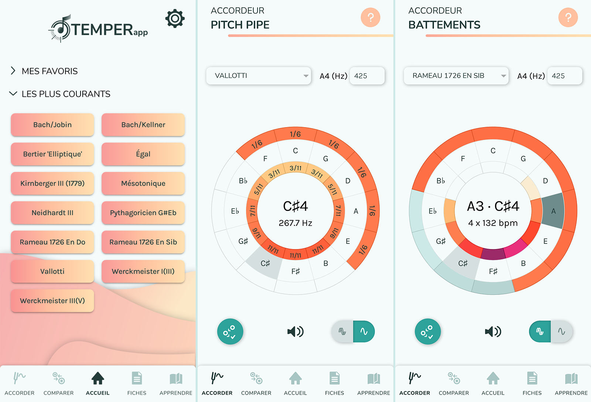
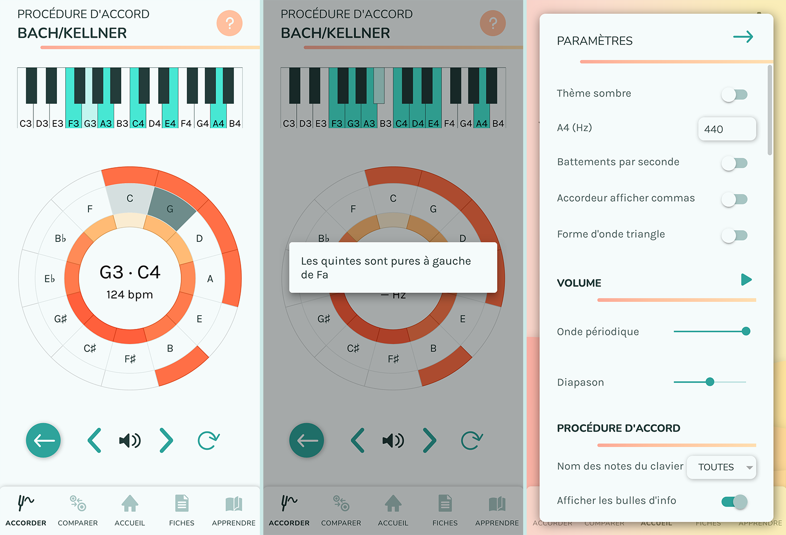
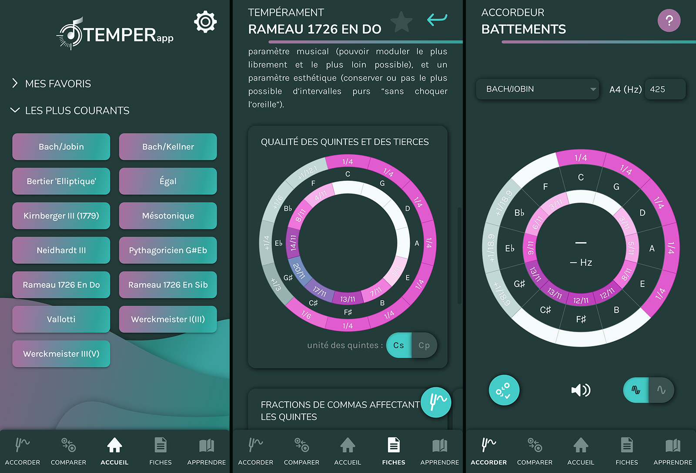
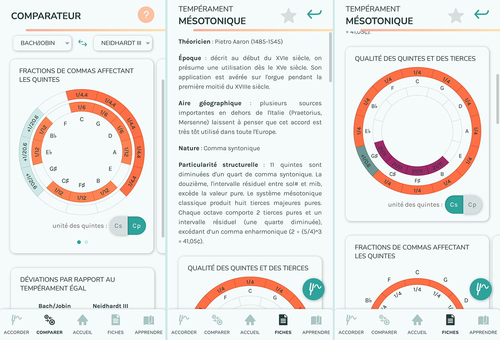
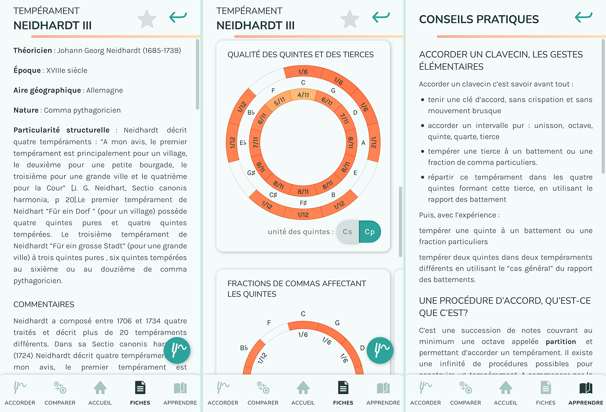

![Ça c'est IMAC](https://img.shields.io/badge/%C3%87a_c'est_IMAC-2022-0.svg?labelColor=252525&color=25afdf&logo=data:image/png;base64,iVBORw0KGgoAAAANSUhEUgAAAA4AAAAMCAYAAABSgIzaAAAACXBIWXMAAAWJAAAFiQFtaJ36AAAF+mlUWHRYTUw6Y29tLmFkb2JlLnhtcAAAAAAAPD94cGFja2V0IGJlZ2luPSLvu78iIGlkPSJXNU0wTXBDZWhpSHpyZVN6TlRjemtjOWQiPz4gPHg6eG1wbWV0YSB4bWxuczp4PSJhZG9iZTpuczptZXRhLyIgeDp4bXB0az0iQWRvYmUgWE1QIENvcmUgNS42LWMxNDUgNzkuMTYzNDk5LCAyMDE4LzA4LzEzLTE2OjQwOjIyICAgICAgICAiPiA8cmRmOlJERiB4bWxuczpyZGY9Imh0dHA6Ly93d3cudzMub3JnLzE5OTkvMDIvMjItcmRmLXN5bnRheC1ucyMiPiA8cmRmOkRlc2NyaXB0aW9uIHJkZjphYm91dD0iIiB4bWxuczp4bXA9Imh0dHA6Ly9ucy5hZG9iZS5jb20veGFwLzEuMC8iIHhtbG5zOmRjPSJodHRwOi8vcHVybC5vcmcvZGMvZWxlbWVudHMvMS4xLyIgeG1sbnM6cGhvdG9zaG9wPSJodHRwOi8vbnMuYWRvYmUuY29tL3Bob3Rvc2hvcC8xLjAvIiB4bWxuczp4bXBNTT0iaHR0cDovL25zLmFkb2JlLmNvbS94YXAvMS4wL21tLyIgeG1sbnM6c3RFdnQ9Imh0dHA6Ly9ucy5hZG9iZS5jb20veGFwLzEuMC9zVHlwZS9SZXNvdXJjZUV2ZW50IyIgeG1wOkNyZWF0b3JUb29sPSJBZG9iZSBQaG90b3Nob3AgQ0MgMjAxOSAoV2luZG93cykiIHhtcDpDcmVhdGVEYXRlPSIyMDE5LTEyLTI2VDEyOjE2OjMyKzAxOjAwIiB4bXA6TW9kaWZ5RGF0ZT0iMjAyMC0wNC0wN1QxOTo1NjoyNyswMjowMCIgeG1wOk1ldGFkYXRhRGF0ZT0iMjAyMC0wNC0wN1QxOTo1NjoyNyswMjowMCIgZGM6Zm9ybWF0PSJpbWFnZS9wbmciIHBob3Rvc2hvcDpDb2xvck1vZGU9IjMiIHBob3Rvc2hvcDpJQ0NQcm9maWxlPSJzUkdCIElFQzYxOTY2LTIuMSIgeG1wTU06SW5zdGFuY2VJRD0ieG1wLmlpZDpiODkxODljMC0yYWZmLTc0NDUtOWViNC03NmU3YjBiNGNkZDQiIHhtcE1NOkRvY3VtZW50SUQ9ImFkb2JlOmRvY2lkOnBob3Rvc2hvcDphMDdhOTk3NS0wN2EyLWExNGUtODE1OC0zYmViYjRkYzliYjkiIHhtcE1NOk9yaWdpbmFsRG9jdW1lbnRJRD0ieG1wLmRpZDo0ZDY4NzIxYS05MzIyLTZiNDItYWI3MC00NDQ0NDY0OWIyZDEiPiA8eG1wTU06SGlzdG9yeT4gPHJkZjpTZXE+IDxyZGY6bGkgc3RFdnQ6YWN0aW9uPSJjcmVhdGVkIiBzdEV2dDppbnN0YW5jZUlEPSJ4bXAuaWlkOjRkNjg3MjFhLTkzMjItNmI0Mi1hYjcwLTQ0NDQ0NjQ5YjJkMSIgc3RFdnQ6d2hlbj0iMjAxOS0xMi0yNlQxMjoxNjozMiswMTowMCIgc3RFdnQ6c29mdHdhcmVBZ2VudD0iQWRvYmUgUGhvdG9zaG9wIENDIDIwMTkgKFdpbmRvd3MpIi8+IDxyZGY6bGkgc3RFdnQ6YWN0aW9uPSJzYXZlZCIgc3RFdnQ6aW5zdGFuY2VJRD0ieG1wLmlpZDpiODkxODljMC0yYWZmLTc0NDUtOWViNC03NmU3YjBiNGNkZDQiIHN0RXZ0OndoZW49IjIwMjAtMDQtMDdUMTk6NTY6MjcrMDI6MDAiIHN0RXZ0OnNvZnR3YXJlQWdlbnQ9IkFkb2JlIFBob3Rvc2hvcCBDQyAyMDE5IChXaW5kb3dzKSIgc3RFdnQ6Y2hhbmdlZD0iLyIvPiA8L3JkZjpTZXE+IDwveG1wTU06SGlzdG9yeT4gPC9yZGY6RGVzY3JpcHRpb24+IDwvcmRmOlJERj4gPC94OnhtcG1ldGE+IDw/eHBhY2tldCBlbmQ9InIiPz5nnotDAAABZElEQVQokW2STSiEURSGn2sm2ShFlBSjjPxlJyYsRE0mPwtqlI2NUSyMEinCxo5REnaiRkQpMjXFgg1KU6SEFUpmZWUijoW+45s4devp3Pue93Z6ERFEhJq2ZbE4HnQrdxzPKduPERE87SsCUFfmYvhtAKu81Y24cosA2KodNNjKiAgAnvYV2XGEAHDmf5I1e2MAOk9CkvkeAWCpIaLiFAs270M6bTtwpGx3Wov1SpLjY0WpNgLlEyraD/tV1LA7JQCpKV9EWqaMiQfdMaAyEXWQd3ltAHxdG9I6Wf8zqDg3SdzjegJYdSaijhhQmdb0qU7nBRncR58tofaLiDO//2FbjjH61ezRA334MuNVt8DugL5ZblswP8sRMQCvc4Xc5vT/EfUdesWk36kIbFv1+cPqdLE3pDxxtp7kZLEREXxdG7+XV9MAON2wODKmA6arupMCoBFq9oc1Wg/lJcrjp2v/Ru4bAbHApDi/6xMAAAAASUVORK5CYII=)

**Contributors**: Fabian Adam, Benjamin Briere, Daphné Chamot-Rooke, Ludwig Chieng et Sterenn Fonseca

Progressive web application for tuning musical instruments by ear in unequal temperaments and learning some of the underlying concepts.

A short Ionic Capacitor React project made for an internship. :mortar_board:

The project is still in the stage of the development and might be unstable. It
might not be maintained anymore as it was made on the spot by students.

TemperApp is the result of research work carried out by :
* Elisa Barbessi, professor of harpsichord and music history at the CRR du Grand-Avignon,
* Jérôme Bertier, pianist, harpsichordist and organist, professor at the conservatory of Auxerre,
* Pierre Cazes, harpsichordist, professor of harpsichord at the CRR 93 (Aubervilliers/La Courneuve), teacher of the history, theory and practice of musical temperaments,
* Franck Jedrzejewski, researcher, doctorate in musicology and philosophy,
* Théodora Psychoyou, member of the IReMus, lecturer at Sorbonne Université (Paris).

## Preview :rocket:

Check the web hosted version on mobile: [https://temperapp1.web.app](https://temperapp1.web.app)



## Getting started :wrench::gear:

```
git clone https://github.com/TemperApp/TemperApp
```
```
cd temperapp
npm install -g @ionic/cli
npm install
```

### Launch the live reload local server

```
ionic serve
```

### Build the project

For deployment, you will need to build the project before

```
ionic build --prod
```

More information available on the Android and iOS deployment in the [Ionic documentation](https://ionicframework.com/docs/react/your-first-app/6-deploying-mobile).

To deploy the progressive web app on a web hosting service like firebase : please check [https://ionicframework.com/docs/react/pwa](https://ionicframework.com/docs/react/pwa).


### Develop for Android

```
ionic capacitor add android
ionic capacitor copy android
ionic capacitor run android -l --host=YOUR_IP_ADDRESS
```
To run the app into an Android Virtual Device, you will need Android Studio.

If it says that it cannot find the ANDROID_SDK, you might want to :
- on Windows: Add a file named `android/local.properties` with the line `sdk.dir = C:/Users/johndoe/AppData/Local/Android/Sdk`. Change `johndoe` to your effective user profile name.

For further information: [check the ionic documentation](https://ionicframework.com/docs/developing/android)

## More screenshots :framed_picture:





